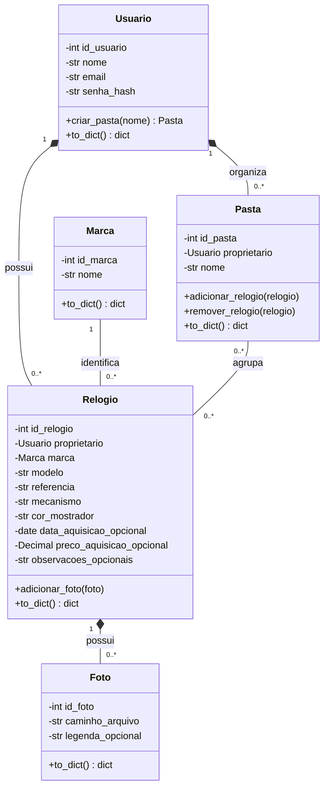

# Diagrama de classes

```mermaid
classDiagram
    class Usuario {
        -int id_usuario
        -str nome
        -str email
        -str senha_hash
        +criar_pasta(nome) Pasta
        +to_dict() dict
    }
    class Marca {
        -int id_marca
        -str nome
        +to_dict() dict
    }
    class Relogio {
        -int id_relogio
        -Usuario proprietario
        -Marca marca
        -str modelo
        -str referencia
        -str mecanismo
        -str cor_mostrador
        -date data_aquisicao_opcional
        -Decimal preco_aquisicao_opcional
        -str observacoes_opcionais
        +adicionar_foto(foto)
        +to_dict() dict
    }
    class Foto {
        -int id_foto
        -str caminho_arquivo
        -str legenda_opcional
        +to_dict() dict
    }
    class Pasta {
        -int id_pasta
        -Usuario proprietario
        -str nome
        +adicionar_relogio(relogio)
        +remover_relogio(relogio)
        +to_dict() dict
    }
    Usuario "1" *-- "0..*" Relogio : possui
    Usuario "1" *-- "0..*" Pasta : organiza
    Marca "1" -- "0..*" Relogio : identifica
    Relogio "1" *-- "0..*" Foto : possui
    Pasta "0..*" -- "0..*" Relogio : agrupa
```

[Arquivo editável no diagrams.net](diagrama-classes.drawio).
